# AM Receiver Design and Implementation

## AM Receiver Demo  

## Circuit Diagram  

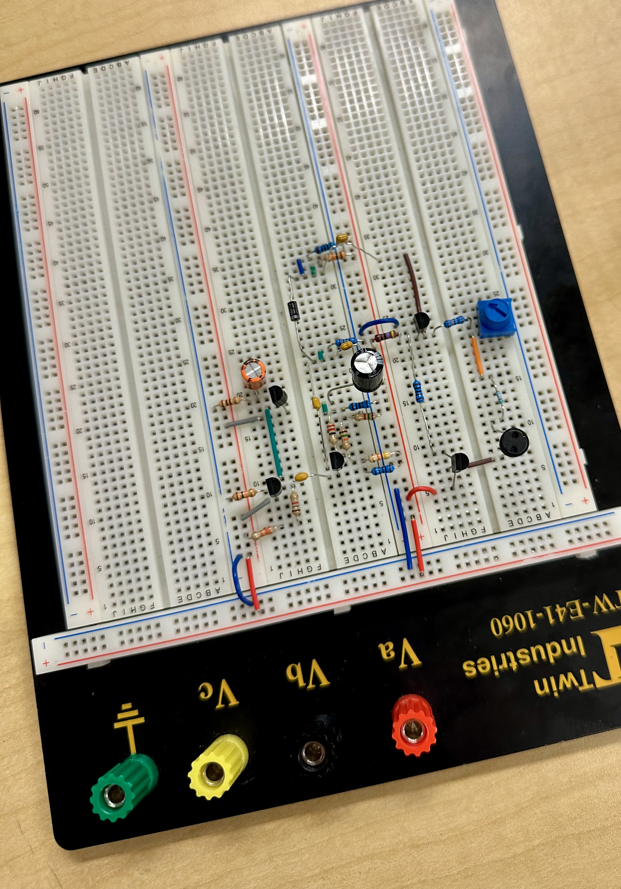

---

## Table of Contents
1. [Objectives](#objectives)
2. [Overview of an AM Receiver System](#overview-of-an-am-receiver-system)
3. [Block Diagram and Key Components](#block-diagram-and-key-components)
4. [Circuit Design and Analysis](#circuit-design-and-analysis)
   - [Part A: LC Tank and Filter Analysis](#part-a-lc-tank-and-filter-analysis)
   - [Part B: Active Filter, Detection, and Amplifiers](#part-b-active-filter-detection-and-amplifiers)
   - [Part C: Complete AM Receiver](#part-c-complete-am-receiver)
5. [Simulation Results](#simulation-results)
6. [How to Run Simulations](#how-to-run-simulations)
7. [Key Observations](#key-observations)

---

## Objectives
1. **Analyze** system design perspectives of an AM receiver.  
2. **Design and implement** a functional AM receiver system.  
3. **Test and evaluate** performance by probing signals and receiving real-time AM broadcasts.

---

## Overview of an AM Receiver System
Amplitude Modulation (AM) varies a carrier signal's amplitude to transmit audio. The receiver demodulates this signal to recover the original audio.  

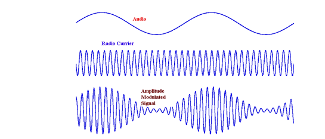  
*Amplitude modulation process.*  

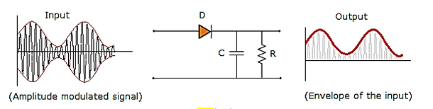  
*Envelope detector rectifies and filters the AM signal.*

---

## Block Diagram and Key Components
The AM receiver system comprises the following stages:  
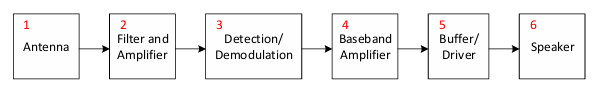  

1. **Antenna**: Captures RF signals.  
2. **Filter + Amplifier**: Selects desired frequency (e.g., 660 kHz) and amplifies it.  
3. **Envelope Detector**: Demodulates the AM signal.  
4. **Baseband Amplifier**: Boosts the audio signal.  
5. **Buffer/Driver**: Drives the speaker.  
6. **Speaker**: Outputs audio.  

---

## Circuit Design and Analysis

### Part A: LC Tank and Filter Analysis

#### LC Tank Resonance
The resonance frequency of an LC tank is calculated as:  
\[
f_0 = \frac{1}{2\pi\sqrt{LC}}
\]  
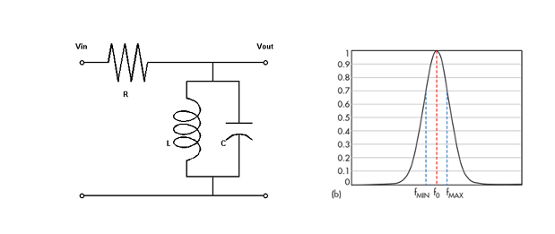  
*Frequency response of the LC tank circuit.*  

#### Detection Circuit
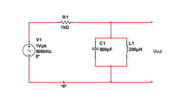  
*Envelope detector with diode and RC low-pass filter.*  

**Simulation Results**  
- **Resonance Shift with Capacitor Sweep**:  
  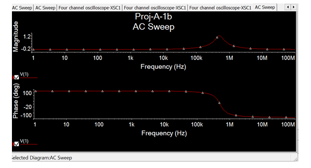
- **Resonance Shift with Device Parameter Sweep**:  
  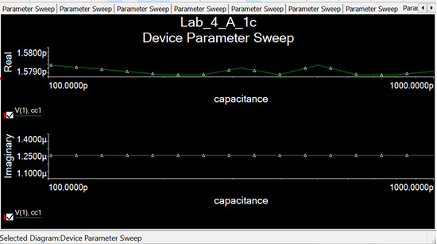  

- **Effect of Changing the Capacitor with respect to the Circuit**

    As the capacitor value changes, so does the resonate frequency, so the output 
    voltage changes in cycles as the frequency gets closer and farther away from 
    the resonate frequency. When the frequency is close to the resonant 
    frequency the Vout is closer to ground. As well, the Vout will get closer to 
    ground as the capacitance increases and the impedance goes to zero.

- **Effect of Parallel Resistor**:  
  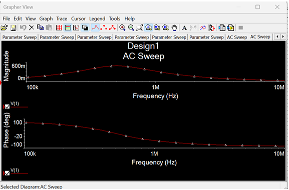

- **Effect of Changing the Resistor with respect to the Circuit**

    The resistor acts to smooth out the resonator, this is because it constantly 
    discharges the capacitor, this causes anti resonance. As the frequency gets 
    closer to the resonant frequency the impedance of the resonator goes to 
    higher and more current goes across the resistor, causing Vout to increase. 
    As the frequency increases the impedance decreases and Vout decreases 

- **Effect of moving the Resistor so that it is in series with the inductor**
    The resistor in series with the inductor will also cause ant resonance 
    because the resistor constantly discharges the capacitor. Because the 
    resistor is in series with the inductor, as the impedance decreases with 
    frequency Vout will decrease it, shorts to ground. 

    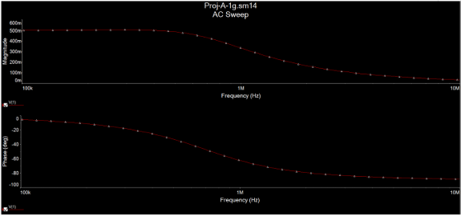

---

### Part B: Active Filter, Detection, and Amplifiers

#### Active Filter Design
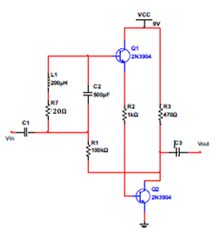  
*Active band-pass filter for signal amplification and filtering.*  

#### Baseband Amplifier
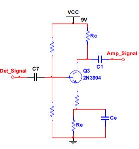  
*Common-emitter amplifier with a gain of ~20.*  

**Simulation Results**  
- **Small Signal Gain**:  
  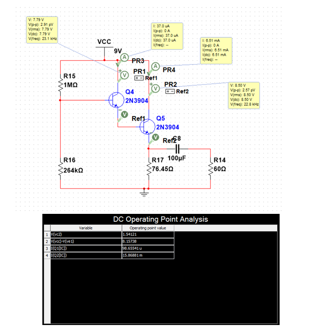  

#### Output Buffer
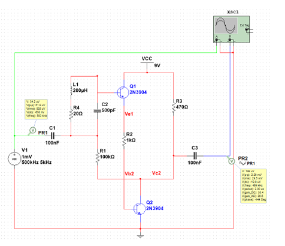  
*Common-collector stage to drive the speaker.*  

**Simulation Results**  
- **Buffer Input/Output**:  
  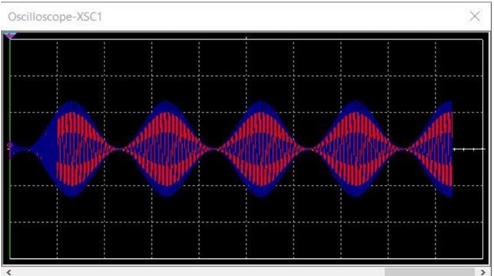  
    Channel A: Input (red) 
    Channel B: Output (blue)

---

### Part C: Complete AM Receiver
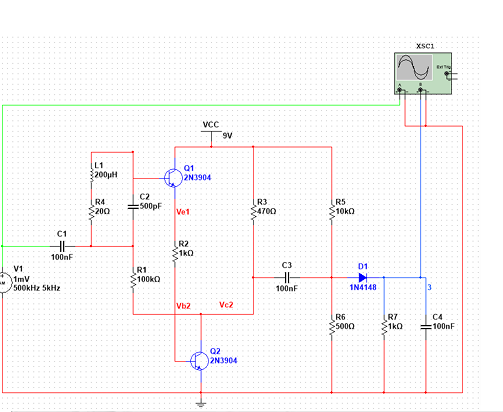  
*Complete schematic of the AM receiver.*  

**Simulation Results**  
- **Demodulated Output**:  
  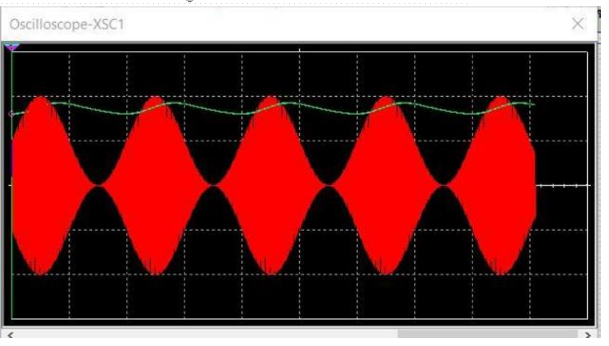
   Channel A: Output in Green 
   Channel B: Input in Red 

---

## Simulation Results
| Component           | Key Simulations       |
|----------------------|-----------------------|
| **LC Tank**          | Resonance frequency, capacitor sweep, parallel resistor effects |
| **Active Filter**    | DC biasing, small-signal gain, modulated input/output |
| **Baseband Amplifier** | Quiescent point, AC response |
| **Output Buffer**    | Input/output waveforms, AC analysis |

---

## How to Run Simulations
1. Use **LTspice** or **Multisim** to open the provided `.ms14` files.  
2. Key simulation files:  
   - `Proj-A-1b.ms14`: LC tank frequency response  
   - `Proj-A-2d.ms14`: Active filter gain analysis  
   - `Proj-B-1d.ms14`: Baseband amplifier input/output  
   - `Proj-C-1.ms14`: Full receiver demodulation  

---

## Key Observations
- **Loading Effects**: Buffering stages prevents signal degradation.  
- **Envelope Detector**: RC time constant must balance ripple filtering and envelope tracking.  
- **Tuning**: LC tank components must align with the target station frequency.  
- **Transistor Biasing**: Critical for linear amplification and minimal distortion.  
